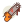
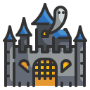
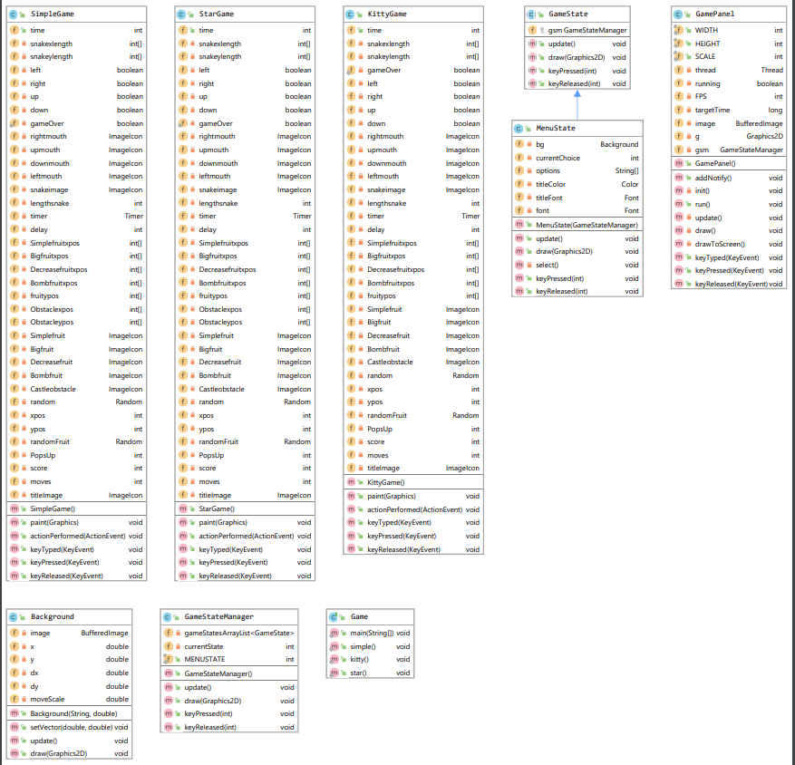

# EP2 - OO 2019.2 (UnB - Gama)

Turmas Renato e Carla
Data de entrega: 12/11/2019


# **TRICKS OR TREATS** - Game Snake com temática de HALLOWEEN

```java
    Ian Fillipe Pontes Ferreira
    18/0102087
    Turma B (Carla)
```   
    
# JAVA
### Versão utilizada para fazer o EP2

```java
    java version "12.0.2" 2019-07-16
    Java(TM) SE Runtime Environment (build 12.0.2+10)
    Java HotSpot(TM) 64-Bit Server VM (build 12.0.2+10, mixed mode, sharing)
```   
    
### Testado também na versão

```java
    java version "13.0.1" 2019-10-15
    Java(TM) SE Runtime Environment (build 13.0.1+9)
    Java HotSpot(TM) 64-Bit Server VM (build 13.0.1+9, mixed mode, sharing)
```   
    
### IDE utilizada

```java   
    IntelliJ IDEA 2019.2
```   

### Bibliotecas utilizadas

```java   
    import javax.swing.JFrame;
    import javax.swing.ImageIcon;
    import javax.swing.JPanel;
    import javax.swing.Timer;
    import java.awt.*;
    import java.util.ArrayList;
    import java.awt.image.BufferedImage;
    import java.awt.event.*;
    import java.awt.image.*;
    import javax.imageio.ImageIO;
    import java.awt.event.KeyEvent;
    import java.awt.Color;
    import java.awt.Graphics;
    import java.awt.Font;
    import java.awt.event.ActionListener;
    import java.awt.event.ActionEvent;
    import java.awt.event.KeyListener;
    import java.util.Random;
 ```     
   
# Como executar o código

```
    Na IDE, dar open project não na pasta ep2, mas sim na pasta SnakeGame.
    Dar o run no arquivo src/Main/Game.java
    
    Executável SnakeGame/SnakeGame.jar (não funcionando corretamente)
```   
    
# Menu do jogo

```   
    O menu possui quatro opções e elas devem ser controladas através das "setinhas" do teclado, e escolhidas 
    através da tecla "Enter".
```   
    
### Opções do menu 
```java
    Comum Pumpkin
    Kitty Ghost
    Star Dracula
    Quit 
```   

# Modos de jogo
### Comum Pumpkin:

```   
    Snake classica, sem habilidades especiais. 
    Está snake não pode atravessar as bordas do jogo, o obstáculo da tela e nem a si mesma
```   
    
### Kitty Ghost:

```   
    Está snake pode atravessar o obstáculo da tela, mas não pode atravessar as bordas do jogo e nem a si mesma.
```   
    
### Star Dracula:

```   
    Recebe o dobro de pontos ao comer as frutas.
    Está snake pode atravessar as bordas do jogo, mas não pode atravessar o obstáculo da tela e nem a si mesma.
```   
* ***Todas as snakes são controladas usando as "setinhas" do teclado***
    
# Tipos de frutas

```Simple Candy```
  **Doce comum, dá um ponto e aumenta o tamanho da Snake.**


```Big Pumpkin```
  **Dá o dobro de pontos da Simple Candy e aumenta o tamanho da Snake da mesma forma que a Simple Candy.**


```Decrease Saw```
 **Diminui o tamanho da Snake para o tamanho inicial, sem fornecer nem retirar pontos.**


```Bomb Poison```
  **Veneno que causa a morte da Snake.**


* As frutas aparecem em locais aleatórios do mapa. 
* Elas ficam na tela por volta de 8 a 9 segundos, quando este tempo acaba, a fruta desaparece e surgi outra. 
* Existe uma probalidade de cada fruta surgir:

```java
Simple Candy: 40%

Big Pumpkin: 20%

Decrease Saw: 13.3%

Bomb Poison: 26.6%
```

# Obstáculo
### *Castle*
   **Obtáculo na tela, que causa a morte da Snake (com exeção da Kitty Ghost).**

# Diagrama de Classes


## Descrição

Para este EP o objetivo será implementar o famoso jogo Snake (também conhecido como "jogo da cobrinha") é um jogo que ficou conhecido por diversas versões cuja versão inicial começou com o jogo Blockade de 1976, sendo feitas várias imitações em vídeo-games e computadores. No fim dos anos 90 foi popularizado em celulares da Nokia que vinham com o jogo já incluso.

O jogador controla uma longa e fina criatura que se arrasta pela tela, coletando comida (ou algum outro item), não podendo colidir com seu próprio corpo ou as "paredes" que cercam a área de jogo. Cada vez que a serpente come um pedaço de comida, seu rabo cresce, aumentando a dificuldade do jogo. O usuário controla a direção da cabeça da serpente (para cima, para baixo, esquerda e direita) e seu corpo segue.

Para este EP o jogo deve conter barreiras em seu cenário, além das especificações abaixo.

## Game Loop

Para o jogo deve ser implementado um game loop. Um game loop é um laço infinito que continua rodando enquanto o jogo estiver sendo executado. O game loop verifica periodicamente os inputs de usuário e realiza as ações requisitadas. Ele deve encerrar com a morte da Snake. Quando o game loop for encerrado deve aparecer uma tela de Game Over.

## Tipos de Snakes

Deve ser implementado ao menos 3 tipos de Snakes:
* **Comum:** A Snake classica, sem habilidades especiais.
* **Kitty:** Essa Snake tem as habilidades de atravessar as barreiras do jogo, mas não pode atravessar as bordas nem a si mesma.
* **Star:** Recebe o dobro de pontos ao comer as frutas.

## Colisões

As Snakes devem colidir com barreiras no interior do jogo, salvo a Snake Kitty que atravessa barreiras. Nenhuma cobra deve atravessar as bordas do jogo. Quando houver algum tipo de colisão, tanto nas barreiras, quanto elas mesmas, a Snake deve morrer.

## Frutas

As frutas são elementos que aparecem aleatoriamente e são os objetivos das Snakes. As frutas devem desaparecer em um tempo especifico e não devem aparecer mais de duas frutas por vez. Devem ser implementados ao menos 4 tipos de frutas:

* **Simple Fruit:** Fruta comum, dá um ponto e aumenta o tamanho da cobra.
* **Bomb Fruit:** Essa fruta deve levar a morte da Snake.
* **Big Fruit:** Dá o dobro de pontos da Simple Fruit e aumenta o tamanho da cobra da mesma forma que a Simple Fruit.
* **Decrease Fruit:** Diminui o tamanho da cobra para o tamanho inicial, sem fornecer nem retirar pontos.

**OBS.:** As frutas podem ser geradas por thread.

## Pontos

Os pontos são calculados de acordo com as frutas coletadas.

**OBS.:** Os pontos podem ser calculados a partir de thread.

## Orientações

O aluno deve escolher se deve implementar thread nos pontos, frutas ou ambos. Lembrando que ter thread faz parte da pontuação do EP.

Quando finalizado, o projeto deverá conter neste README as instruções de execução (comandos, menus, etc) e a lista de dependências (bibliotecas ou pacotes necessários para se executar o software).

## 5. Critérios de Avaliação

 A avaliação será realizada seguindo os seguintes critérios:

|   ITEM    |   COMENTÁRIO  |   VALOR   |
|------------------------|---------------------------------------------------------------------------------------------------------|---------|
|**Game Loop**| A aplicação deve ter implementados o Game Loop do Jogo com tela de Game Over ao final. |    1,0 |
|**Tipos de Snake e Frutas**| A aplicação deve ter implementados os 3 tipos de cobra e 4 tipos de fruta. |   1,0 |
|**Herança**| Utilização de Herança (que faça sentido).  |   1,0 |
|**Polimorfismo**|  No código deve haver, no mínimo, três casos de polimorfismo sendo utilizados.    |   1,0 |
|**Encapsulamento**| Utilização adequada de encapsulamento em todas as classes.    |   1,0 |
|**Modelagem**| Qualidade do código e dos relacionamentos entre classes.  |  0,5 |
|**Thread**| O jogo deve possuir ao menos uma thread.  |  0,5 |
|**Interface**| O programa deve possuir a interface Swing e possuir interação com o usuário |   1,0 |
|**Qualidade do Código**| Utilização de boas práticas como o uso de bons nomes, modularização e organização em geral.    |  1,0 |
|**UML**| O EP deve possuir um diagrama UML em sua documentação |  1,0 |
|**Repositório**|   Utilização correta do repositório, commits claros e frequentes. |   1,0 |
|      |    TOTAL   |   10  |
|**Pontuação Extra**| Possiveis pontos extras:<br/>- Ranking em arquivo com nome do jogador e quantidade de pontos<br/>- Fazer as cobras atravessarem as bordas do jogo aparecendo no outro lado<br/>- Testes automatizados|  0,5 (para cada funcionalidade) |
